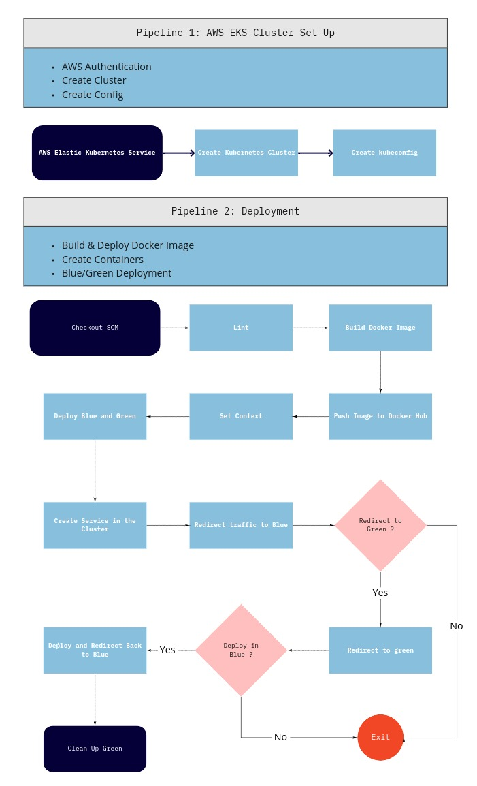

# Udacity Cloud DevOps Engineer Capstone Project

In this project, we created a CI/CD pipeline to create a Blue/Green deployment to a kubernetes cluster in AWS, using EKS and Jenkins.

## Branches

First off, the code is divided in two branches. Each branch corresponds to a pipeline in Jenkins, and you can see what each pipeline is responsible for in the image below.



## Project Requirements:

> To be able to use this CI/CD pipeline you will need:

* Jenkins
* Blue Ocean Plugin in Jenkins
* Pipeline-AWS Plugin in Jenkins
* Docker
* Pip
* AWS Cli
* Eksctl
* Kubectl

# Files

> branch master
```sh
* /images : Screenshots of each deploy step.
* README.md : Project Documentation
```
> branch create_clusters
```sh
* Jenkinsfile : CloudFormation Script used in Jenkins to set up Clusters
```
> branch deploy
```sh
* Jenkinsfile : Jenkinsfile to create the pipeline in Jenkins
* Dockerfile : Dockerfile for building the image 
* green-controller.json : Create a replication controller green pod
* green-service.json : Create green service
* blue-controller.json : Create a replication controller blue pod
* blue-service.json : Create blue service
* index.html : Sample html page
```
## Run the project:
```sh
* Follow the steps contained in the screenshots in images folder.
```
